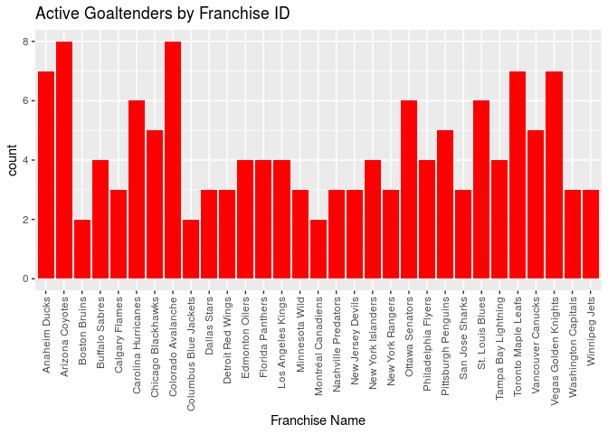
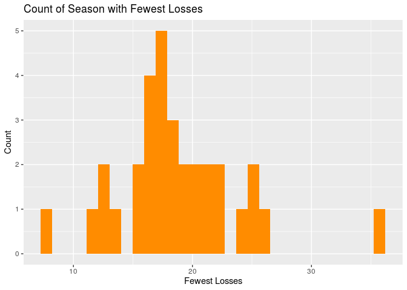
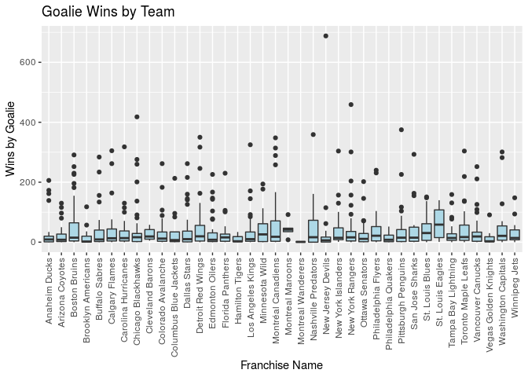
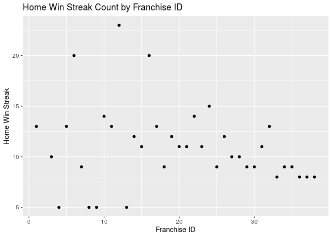
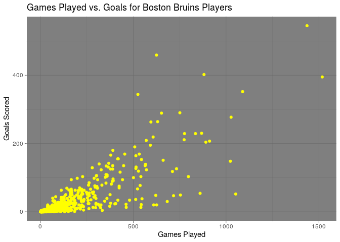

R Project 1
================

  - [Required Packages](#required-packages)
  - [Contact the NHL records API and the NHL stats
    API](#contact-the-nhl-records-api-and-the-nhl-stats-api)
      - [nhl\_records function:](#nhl_records-function)
      - [nhl\_stats function:](#nhl_stats-function)
      - [nhl\_data function:](#nhl_data-function)
  - [Some exploratory data analysis](#some-exploratory-data-analysis)
      - [Join on two returned datasets from different API
        endpoints](#join-on-two-returned-datasets-from-different-api-endpoints)
      - [Create two new variables](#create-two-new-variables)
      - [Contingency tables](#contingency-tables)
      - [Numerical summaries for some quantitative variables at each
        setting of some of the categorical
        variables](#numerical-summaries-for-some-quantitative-variables-at-each-setting-of-some-of-the-categorical-variables)
      - [Plots utilizing the fetched data and common options for
        `ggplot`
        functions.](#plots-utilizing-the-fetched-data-and-common-options-for-ggplot-functions.)

# Required Packages

``` r
library(httr)
library(jsonlite)
library(dplyr)
library(ggplot2)
```

# Contact the NHL records API and the NHL stats API

## nhl\_records function:

``` r
nhl_records(endpoint, team_id=NULL, team_name=NULL)
```

The `nhl_records` function pulls data from `records.nhl.com` and outputs
it to a data frame. It takes on multiple arguments:

  - `endpoint`: can take on five values (`Franchise, TeamTotals,
    Franchise_SeasonTotals, GoalieRecords, SkaterRecords`). This option
    will pull data from different API tables. The value for this
    variable must be passed as a string.  
  - `team_id`: is a unique numeric identifier for each NHL team. By
    passing this, the value returned will only contain data for that
    specific NHL team. By default, this value is set to `NULL`.  
  - `team_name`: is a unique character assignment for each NHL team.
    Team names take on the format ‘<City> <Club Name>’. By passing this,
    the value returned will only contain data for that specific NHL
    team. By default, this value is set to `NULL`.

## nhl\_stats function:

``` r
nhl_stats(modifier, modifier_extension=NULL, team_id=NULL)
```

The `nhl_stats` function pulls data from `www.statsapi.web.nhl.com` and
outputs it to a data frame. It takes on multiple arguments:

  - `modifier`: can take on one of eight values (`team_roster,
    person_names, team_schedule_next, team_schedule_previous,
    team_stats, team_roster_season, team_id, single_season_playoff`).
    This value will run an expand command on the API. The value for this
    variable must be passed as a string.  
  - `modifier_extension`: Allows the user to pass additional search
    options to the API. An example of this would be `&gameType=P` to
    pull data from playoff games only. By default, this value is set to
    `NULL`. The value for this variable must be passed as a string.  
  - `team_id`: is a unique numeric identifier for each NHL team. By
    passing this, the value returned will only contain data for that
    specific NHL team. By default, this value is set to `NULL`.

## nhl\_data function:

``` r
nhl_data(source, ...)
```

The `nhl_data` function serves as a wrapper function for `nhl_records`
and `nhl_stats`.

  - `source`: calls whichever function is needed (`records` or `stats`).
    This argument must be passed a string.  
  - `...`: allows the user to pass all arguments supported by the
    functions `nhl_records` and `nhl_stats`.

# Some exploratory data analysis

## Join on two returned datasets from different API endpoints

``` r
# Import the first data set using 'nhl_records' via the wrapper function
dat_1 <- nhl_data('records', endpoint='Franchise', team_name='Boston Bruins')

# Import the second data set using 'nhl_stats' via the wrapper function 
dat_2 <- nhl_data('stats', modifier='team_stats', team_id=6)

# Rename the full team name variable 'name' in 'dat_2' to prepare to merge the data sets
dat_2 <- dplyr::rename(dat_2, teamCommonName=name)

# Merge the two datasets
dat_3 <- merge(dat_1, dat_2, by='teamCommonName')

# Partial output
dat_3[1:5]
```

    ##   teamCommonName firstSeasonId lastSeasonId mostRecentTeamId            link
    ## 1  Boston Bruins      19241925           NA                6 /api/v1/teams/6

## Create two new variables

  - New variable: **Average games started**  
    This variable will look at the average amount of games started by
    Carolina Hurricane goaltenders.

<!-- end list -->

``` r
# Create a new variable, average_games_started
car_goal <- nhl_data('records', endpoint='GoalieRecords', team_name='Carolina Hurricanes')
car_avg_game <- mean(car_goal$gamesPlayed)
average_games_started <- rep(car_avg_game, times=nrow(car_goal))

# Add a new column corresponding to the average number of games a goaltender starts as a Hurricane
car_goal <- cbind(car_goal, average_games_started)

# Display a partial output
head(car_goal[,c(2,7,4,6,29)])
```

    ##   firstName    lastName       franchiseName gamesPlayed average_games_started
    ## 1       Cam        Ward Carolina Hurricanes         668                  81.5
    ## 2    Arturs        Irbe Carolina Hurricanes         309                  81.5
    ## 3       Tom    Barrasso Carolina Hurricanes          34                  81.5
    ## 4   Richard     Brodeur Carolina Hurricanes           6                  81.5
    ## 5      Sean       Burke Carolina Hurricanes         256                  81.5
    ## 6      Mark Fitzpatrick Carolina Hurricanes           3                  81.5

  - New variable: **Hat trick**  
    A hat trick is three or more goals scored by a player in a single
    game. This variable will determine if a player has scored a hat
    trick in their career.

<!-- end list -->

``` r
# Create a new variable, hat_trick
bos_skate <- nhl_data('records', endpoint='SkaterRecords', team_name='Boston Bruins')
hat_trick <- ifelse(bos_skate$mostGoalsOneGame > 2, TRUE, FALSE)

# Add a column corresponding to the new variable hat_trick
bos_skate <- cbind(bos_skate, hat_trick)

# A partial output including our new variable
head(bos_skate[,c(3,9,5,8,15,30)])
```

    ##   firstName lastName franchiseName goals mostGoalsOneGame hat_trick
    ## 1    Johnny    Bucyk Boston Bruins   545                4      TRUE
    ## 2       Ray  Bourque Boston Bruins   395                3      TRUE
    ## 3     Terry O'Reilly Boston Bruins   204                3      TRUE
    ## 4      Phil Esposito Boston Bruins   459                4      TRUE
    ## 5     Bobby      Orr Boston Bruins   264                3      TRUE
    ## 6       Jay   Miller Boston Bruins    13                2     FALSE

## Contingency tables

``` r
# Import the entire 'SkaterRecords' data frame for the original six teams
original_six <- c('Chicago Blackhawks', 'Boston Bruins', 'Montréal Canadiens', 'Detroit Red Wings', 
                  'New York Rangers', 'Toronto Maple Leafs')
origsix_skate <- nhl_data('records', endpoint='SkaterRecords', team_name=original_six)

# Create a contingency table of original six team players by position
table(origsix_skate$franchiseName, origsix_skate$positionCode) 
```

    ##                      
    ##                        C  D  L  R
    ##   Boston Bruins       36 35 34 27
    ##   Chicago Blackhawks  40 53 28 28
    ##   Detroit Red Wings   39 49 35 25
    ##   Montréal Canadiens  34 37 38 26
    ##   New York Rangers    37 50 39 45
    ##   Toronto Maple Leafs 40 33 30 40

*The above table is a contingency table with the counts of players from
each team in the data set by their position.*

    ##                      
    ##                       FALSE TRUE
    ##   Boston Bruins         122   10
    ##   Chicago Blackhawks    139   10
    ##   Detroit Red Wings     139    9
    ##   Montréal Canadiens    128    7
    ##   New York Rangers      163    8
    ##   Toronto Maple Leafs   132   11

*The above table is a contingency table with counts of players from
original six teams that are either active or retired.*

## Numerical summaries for some quantitative variables at each setting of some of the categorical variables

``` r
# Import the full 'SkaterRecords' data set
skater_full <- nhl_data('records', endpoint='SkaterRecords') 
```

``` r
# Mean goals scored by position
round(tapply(skater_full$goals, skater_full$positionCode, mean), 2)
```

    ##     C     D     L     R 
    ## 27.76  8.82 24.18 28.28

*The summary statistics above show mean amount of goals scored by
position. As can be seen, centers and wingers typically show up in the
scoring column more than defensemen*

``` r
# Mean goals scored by team
round(tapply(skater_full$goals, skater_full$franchiseName, mean), 2)
```

    ##         Anaheim Ducks       Arizona Coyotes         Boston Bruins 
    ##                 14.94                 17.81                 22.95 
    ##    Brooklyn Americans        Buffalo Sabres        Calgary Flames 
    ##                 11.65                 26.64                 21.85 
    ##   Carolina Hurricanes    Chicago Blackhawks      Cleveland Barons 
    ##                 19.65                 22.34                 16.40 
    ##    Colorado Avalanche Columbus Blue Jackets          Dallas Stars 
    ##                 20.71                 14.72                 20.33 
    ##     Detroit Red Wings       Edmonton Oilers      Florida Panthers 
    ##                 23.41                 20.66                 14.93 
    ##       Hamilton Tigers     Los Angeles Kings        Minnesota Wild 
    ##                 14.03                 21.55                 16.05 
    ##    Montréal Canadiens      Montreal Maroons    Montreal Wanderers 
    ##                 27.37                 18.90                  1.55 
    ##   Nashville Predators     New Jersey Devils    New York Islanders 
    ##                 16.68                 19.97                 23.19 
    ##      New York Rangers       Ottawa Senators   Philadelphia Flyers 
    ##                 20.13                 17.45                 23.44 
    ##  Philadelphia Quakers   Pittsburgh Penguins       San Jose Sharks 
    ##                 11.89                 20.63                 19.58 
    ##       St. Louis Blues      St. Louis Eagles   Tampa Bay Lightning 
    ##                 20.77                 17.16                 16.31 
    ##   Toronto Maple Leafs     Vancouver Canucks  Vegas Golden Knights 
    ##                 22.90                 21.24                 15.70 
    ##   Washington Capitals         Winnipeg Jets 
    ##                 22.12                 16.17

*The summary statistics above show average goals scored by team. As can
be seen, franchises which no longer exist seem to be outliers compared
to the rest of the data set. This could possibly be a result of the
style of play changing over time and not being representative of what
scores typically were when they were active franchises.*

``` r
# Mean penalty minutes by position
round(tapply(skater_full$penaltyMinutes, skater_full$positionCode, mean), 2)
```

    ##      C      D      L      R 
    ##  73.05 115.28  97.78 101.42

*The summary statistics above show the average penaly minutes by
position. Defensemen average the highest amount of penalty minutes,
which centers average the least. It might be interesting to try to drill
into if strategy or style of play factors into these means.*

``` r
# Mean penalty minutes by team
round(tapply(skater_full$penaltyMinutes, skater_full$franchiseName, mean), 2)
```

    ##         Anaheim Ducks       Arizona Coyotes         Boston Bruins 
    ##                 80.19                 94.26                 94.67 
    ##    Brooklyn Americans        Buffalo Sabres        Calgary Flames 
    ##                 48.02                127.98                110.19 
    ##   Carolina Hurricanes    Chicago Blackhawks      Cleveland Barons 
    ##                 99.64                104.47                 69.94 
    ##    Colorado Avalanche Columbus Blue Jackets          Dallas Stars 
    ##                102.53                 72.16                101.19 
    ##     Detroit Red Wings       Edmonton Oilers      Florida Panthers 
    ##                 99.35                105.05                 77.18 
    ##       Hamilton Tigers     Los Angeles Kings        Minnesota Wild 
    ##                 32.19                107.51                 66.11 
    ##    Montréal Canadiens      Montreal Maroons    Montreal Wanderers 
    ##                108.66                 93.95                  2.45 
    ##   Nashville Predators     New Jersey Devils    New York Islanders 
    ##                 69.82                 98.25                109.32 
    ##      New York Rangers       Ottawa Senators   Philadelphia Flyers 
    ##                 85.38                 82.37                128.39 
    ##  Philadelphia Quakers   Pittsburgh Penguins       San Jose Sharks 
    ##                 55.87                 97.36                 95.34 
    ##       St. Louis Blues      St. Louis Eagles   Tampa Bay Lightning 
    ##                105.56                 67.38                 81.18 
    ##   Toronto Maple Leafs     Vancouver Canucks  Vegas Golden Knights 
    ##                103.60                115.54                 34.83 
    ##   Washington Capitals         Winnipeg Jets 
    ##                109.28                 74.60

*The summary statistics above show the average penalty minutes by
franchise. Once again we see defunct franchises (i.e. `Montreal
Wanderers`) and new franchises (i.e. `Vegas Golden Knights`) do not
necessarily fit in with the remainder of the dataset. This would raise
questions about deeper trends within the data set.*

## Plots utilizing the fetched data and common options for `ggplot` functions.

``` r
goalie_records <- dplyr::filter(nhl_data('records', endpoint='GoalieRecords'), activePlayer==TRUE)

# Bar plot
g <- ggplot(data=goalie_records, aes(x=franchiseName))

g + geom_bar(fill='Red') + ggtitle('Active Goaltenders by Franchise ID') + xlab('Franchise Name') +
  theme(axis.text.x = element_text(angle = 90, vjust = 0.5, hjust=1))
```

<!-- -->

*The above graph shows active NHL goaltenders in the NHL by the
franchise name that they play for. Defunct teams, which have no active
players, have been removed from the plot.*

``` r
# Histogram
franchise_seasontotals <- nhl_data('records', endpoint='Franchise_SeasonTotals')

g <- ggplot(data=franchise_seasontotals, aes(x=fewestLosses))

g + geom_histogram(fill='Dark Orange') + xlab('Fewest Losses') + ylab('Count') + 
  ggtitle('Count of Season with Fewest Losses')
```

<!-- -->

*The above plot shows a histogram with the count of the fewest losses by
each NHL team.*

``` r
# Box plot
goalie_records <- nhl_data('records', endpoint='GoalieRecords')

g <- ggplot(data=goalie_records, aes(x=as.factor(franchiseName), y=wins))

g + geom_boxplot(fill='Light Blue') + ylab('Wins by Goalie') + xlab('Franchise Name') +
  theme(axis.text.x = element_text(angle = 90, vjust = 0.5, hjust=1)) +
  ggtitle('Goalie Wins by Team')
```

<!-- -->

*The above plot is a box-plot of goalie wins by the franchise that they
played for. Marty Brodeur is the obvious outlier for the New Jersey
Devils.*

``` r
# Scatterplot
g <- ggplot(data=franchise_seasontotals, aes(x=franchiseId, y=homeWinStreak))

g + geom_point() + ggtitle('Home Win Streak Count by Franchise ID') + xlab('Franchise ID') + ylab('Home Win Streak')
```

<!-- -->

*The above scatterplot shows Home Win Streak counts by Franchise ID.
Franchise ID 6, 12, and 16 appear to be outliers. Formal testing could
be used to determine if they are actually different from the mean*

<!-- -->

*The above plot is a scatterplot of games played vs goals scored. A
higher y-axis value with a lower x-axis value would suggest higher goal
production.*
